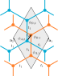

---
jupytext:
  text_representation:
    extension: .md
    format_name: myst
    format_version: 0.13
    jupytext_version: 1.14.4
kernelspec:
  display_name: Python 3 (ipykernel)
  language: python
  name: python3
---

# k.p model of bilayer graphene

This tutorial demonstrates how to use symbolic expressions as input to Pymablock.
As an example, we construct the k.p Hamiltonian of bilayer graphene, starting from its tight binding dispersion.

The crystal structure and the hoppings of bilayer graphene are shown in the figure



The physics of this system is not crucial for us, but here are the main features:

- The unit cell is spanned by vectors $\mathbf{a}_1=(1/2, \sqrt{3}/2)$ and $\mathbf{a}_2=(-1/2, \sqrt{3}/2)$.
- The unit cell contains 4 atoms with wave functions $\phi_{A,1}, \phi_{B,1}, \phi_{A,2}, \phi_{B,2}$.
- The hoppings within each layer are $t_1$.
- The interlayer hopping couples atoms that are on top of each other with amplitude $t_2$.
- The layers have a potential $\pm m$ that we introduce to make the problem a bit more complex.

If you want to get a more systematic introduction to the bilayer graphene and its k.p model, you can check out [this review](https://iopscience.iop.org/article/10.1088/0034-4885/76/5/056503).

Let's start from defining the Hamiltonian.
We will use [`sympy`](https://www.sympy.org/) for symbolic computation and manipulation which can make the code somewhat verbose.

We begin with the basic imports

```{code-cell} ipython3
import numpy as np
from sympy import symbols, Matrix, sqrt, Eq, exp, I, pi, Add, MatAdd
from sympy.physics.vector import ReferenceFrame

import sympy
```

## Define a symbolic Hamiltonian

Now we are ready to define all the parameters and the hamiltonian $H$

```{code-cell} ipython3
k_x, k_y, t_1, t_2, m = symbols("k_x k_y t_1 t_2 m", real=True)
alpha = symbols(r"\alpha")

H = Matrix(
    [[m, t_1 * alpha, 0, 0],
     [t_1 * alpha.conjugate(), m, t_2, 0],
     [0, t_2, -m, t_1 * alpha],
     [0, 0, t_1 * alpha.conjugate(), -m]]
)
Eq(symbols("H"), H, evaluate=False)
```

The Hamiltonian elements are {autolink}`~sympy.core.symbol.symbols`.
We collected all momentum-dependent factors into the symbol $\alpha$.

We also make $\mathbf{K}=(4\pi/3, 0)$ the reference point for the $\mathbf{k}$-vector, making $k_x$ and $k_y$ the perturbative parameters.

```{code-cell} ipython3
N = ReferenceFrame("N")
a_1 = (sqrt(3) * N.y + N.x) / 2
a_2 = (sqrt(3) * N.y - N.x) / 2
k = (4 * pi / 3 + k_x) * N.x + k_y * N.y

alpha_k = (1 + exp(I * k.dot(a_1)) + exp(I * k.dot(a_2))).expand(complex=True, trig=True)
Eq(alpha, alpha_k, evaluate=False)
```

## Define the perturbative series

Now we obtain the eigenvectors of the unperturbed Hamiltonian by substituting the unperturbed values ({autolink}`~sympy.core.basic.Basic.subs`) and diagonalizing ({autolink}`~sympy.matrices.matrices.MatrixEigen.diagonalize`).

```{code-cell} ipython3
vecs = H.subs({alpha: 0, m: 0}).diagonalize(normalize=True)[0]
vecs
```

After substituting the full expression for $\alpha(k)$ into the Hamiltonian, we are ready to `block_diagonalize` it.
For that we specify which symbols are the perturbative parameters using `symbols` argument.
The order of `symbols` is important: it defines the order of variables in the perturbative series.

```{code-cell} ipython3
from pymablock import block_diagonalize

H_tilde = block_diagonalize(
    H.subs({alpha: alpha_k}),
    symbols=(k_x, k_y, m),
    subspace_eigenvectors=[vecs[:, :2], vecs[:, 2:]]
)[0]
```

The names of `symbols` specifying the perturbative parameters are stored in the `dimension_names` attribute of the result:

```{code-cell} ipython3
H_tilde.dimension_names
```

:::{admonition} All symbols are commutative
:class: warning
Pymablock treats all `symbols` as commutative by default.
To use not-commutative symbols, like e.g. $x$ and $k_x$, add
these into the Hamiltonian directly instead.
:::

Now we are ready to specify which calculation to perform.

To compute the standard quadratic dispersion of bilayer graphene and trigonal warping, we need corrections up to third order in momentum.
Let us then group the terms by total power of momentum.
For now this requires an explicit definition of all components, but in the future we plan to automate this step.

```{code-cell} ipython3
k_square = np.array([[0, 1, 2], [2, 1, 0]])
k_cube = np.array([[0, 1, 2, 3], [3, 2, 1, 0]])
```

:::{admonition} A more general way to group by power
:class: dropdown tip
The above manual definition of `k_square` and `k_cube` becomes cumbersome for higher orders or dimensions. Instead, we can use the `np.mgrid` and select the terms we need by total power like this:

```python
k_powers = np.mgrid[:4, :4]
k_square = k_powers[..., np.sum(k_powers, axis=0) == 2]
k_cube = k_powers[..., np.sum(k_powers, axis=0) == 3]
```

:::

Before we saw that querying `H_tilde` returns the results in a numpy array.
To gather different entries into one symbolic expression, we define a convenience function that sums several orders together. This uses the {autolink}`~numpy.ma.MaskedArray.compressed` method of masked numpy arrays, and simplifies the resulting expression.

```{code-cell} ipython3
def H_tilde_AA(*orders):
    return Add(*H_tilde[0, 0, orders[0], orders[1], orders[2]].compressed()).simplify()
```

Finally, we are ready to obtain the result.

```{code-cell} ipython3
%%time

mass_term = H_tilde_AA([0], [0], [1])
kinetic = H_tilde_AA(*k_square, 0)
mass_correction = H_tilde_AA(*k_square, 1)
cubic = H_tilde_AA(*k_cube, 0)
MatAdd(mass_term + kinetic, mass_correction + cubic, evaluate=False)
```

The first term contains the standard quadratic dispersion of bilayer graphene with a gap.
The second term contains trigonal warping and the coupling between the gap and momentum.
